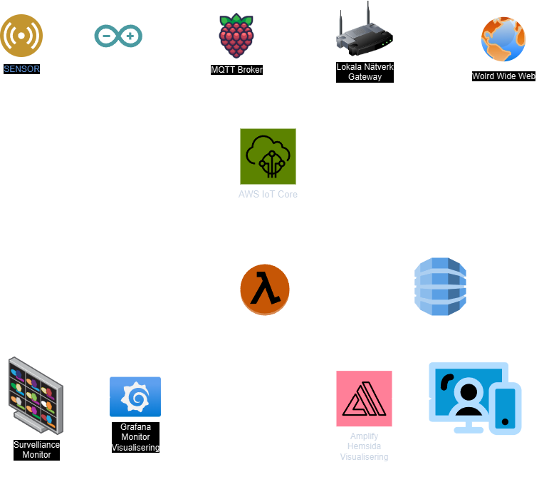
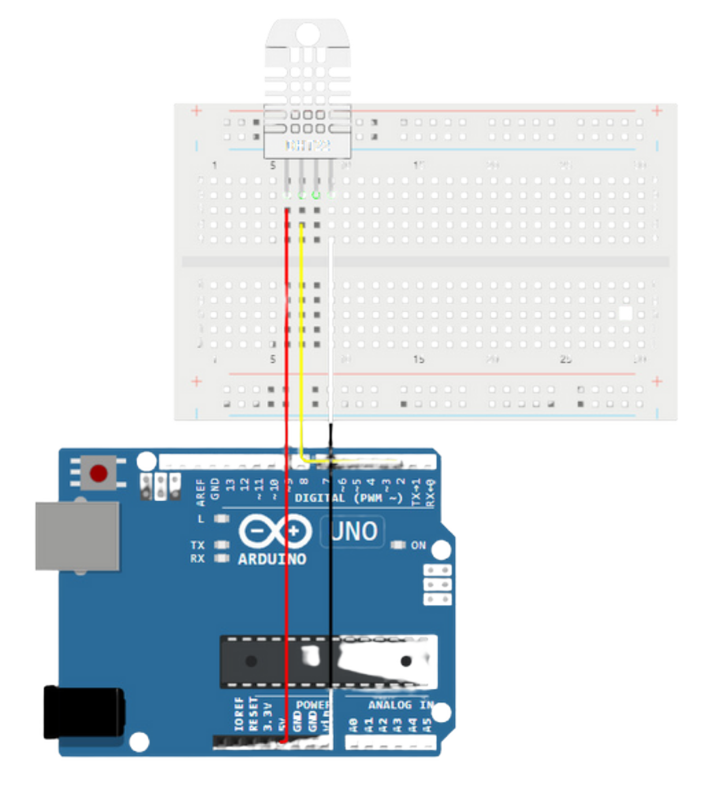
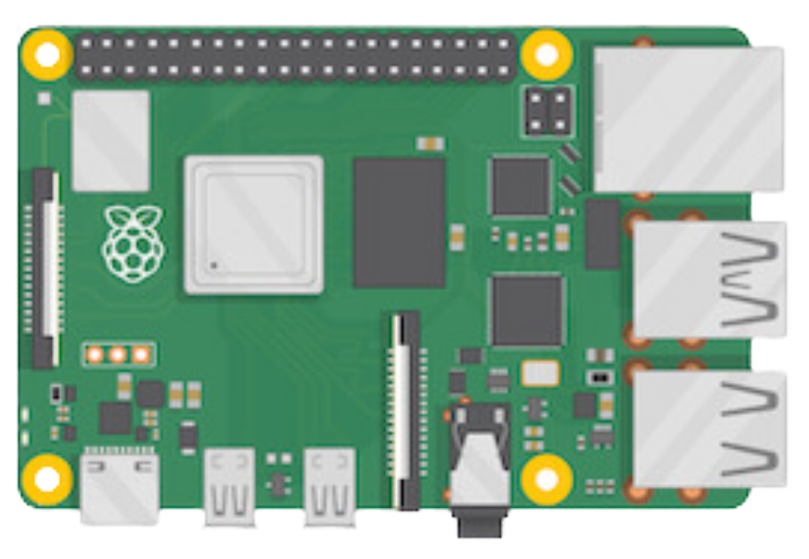

# Temperature and Humidity Monitoring with Arduino, Raspberry Pi, and AWS IoT Core



## Table of Contents

1. [Overview](#overview)
2. [Introduction](#introduction)
3. Project Components
4. System Architecture
4. Instructions
	- Step 1: Installation and Configuration
	- Step 2: Wiring
	- Step 3: Connectivity
	- Step 4: Data Transmission to AWS IoT Core
	- Step 5: Data Visualization
6. Security
7. Scalability
8. Conclusion
9. Future Work


## Overview
This project uses an Arduino Uno R4 WiFi along with a DHT11 sensor to monitor temperature and humidity levels. The data collected by the sensor is transmitted via MQTT to a Raspberry Pi, which serves as the MQTT broker. The Raspberry Pi subsequently sends the data to AWS IoT Core, where it is stored in a DynamoDB table and displayed on a web page created with AWS Amplify. This configuration allows for remote monitoring of sensor data and lays a solid foundation for future enhancements.

## Introduction
This IoT project focuses on real-time monitoring of temperature and humidity using an Arduino Uno R4 WiFi paired with a DHT11 sensor. The system utilizes MQTT for transmitting data to a Raspberry Pi, which subsequently sends the information to AWS IoT Core for storage and visualization.

### Who Can Use This Project?
- Home Users: Keep track of indoor environments, including home climate, greenhouses, or server rooms.
- Industrial Users: Monitor conditions in warehouses, factories, or data centers to ensure quality control and safety compliance.
- Developers & Hobbyists: Explore and experiment with IoT concepts, data collection, and cloud integration.

### Potential Use Cases
- Home Automation: Control heating, cooling, or humidifiers based on real-time data.
- Industrial Monitoring: Maintain optimal environmental conditions for sensitive equipment or products.
- Data Analytics: Examine historical data for trends and predictive maintenance.
- Educational Purposes: Provide instruction on IoT, cloud integration, and data visualization techniques.

## Project Components
- Hardware
	- Arduino Uno R4 WiFi: A microcontroller designed for reading sensor data and communicating through MQTT.
	- DHT11 Sensor: A device that measures temperature and humidity.
	- Raspberry Pi: Acts as the MQTT broker and serves as an intermediary to forward data to AWS IoT Core.
 - Software
 	- Arduino IDE
 	- MQTT Libraries
  	- AWS service
		- AWS IoT Core: A service that manages IoT devices and their data.
		- AWS DynamoDB: A database used for storing sensor readings.
		- AWS Lambda: A serverless function that processes data by sending over to other applications..
		- AWS Amplify: A tool for creating a web interface to visualize sensor data.

## System Architecture
- DHT11 Sensor → Arduino → MQTT Broker (Raspberry Pi) → AWS IoT Core → DynamoDB
- Visualization happens via AWS Amplify and a Lambda function to build a simple web interface.

## Instructions
### Step 1: Installation and Configuration
1. Install Arduino IDE:
	- Download and install the latest version of the Arduino IDE.
2. Install Libraries:
	- In Arduino IDE, go to Sketch > Include Library > Manage Libraries and search for the following libraries:
		- DHT sensor library (for reading from the DHT11 sensor).
		- PubSubClient (for MQTT communication).
3. Install MQTT Broker on Raspberry Pi:
	- Install an MQTT broker such as Mosquitto on your Raspberry Pi.
4. Install AWS CLI and IoT Core SDK:
	- Follow the AWS IoT Core documentation to configure and install the AWS CLI.
5. 

### Step 2: Wiring


Connect to the DHT11 to the Arduino Uno R4 WiFi as follow:
	- VCC → 5V on Arduino
	- SDA → Pin 2 on Arduino
	 - GND → GND on Arduino
  
### Step 3: Connectivity
1. Configure MQTT in Arduino Code:
	- In main.ino, configure your MQTT server (Raspberry Pi’s IP address) and Wi-Fi settings (SSID and password).
	- Use the PubSubClient library to connect to the MQTT server and publish temperature and humidity data.



2. Configure MQTT Broker on Raspberry Pi:
	- Install Mosquitto and configure it to listen for incoming MQTT messages from the Arduino.
    	```
     	sudo apt-get update
     	sudo apt-get install mosquitto mosquitto-clients
     	```
	- Configure the MQTT broker for the local network.
 	- Use the following configuration in main.ino
    	```
     	mqtt_server = "192.168.x.x"; // Replace with Raspberry Pi IP address 
     	```
	- Create subscriptions for the specific topics published by the Arduino.

### Step 3: Data Transmission to AWS IoT Core
- Configure the Raspberry Pi to forward MQTT messages to AWS:
	- Establish a secure connection using certificates.
 	- Send data in JSON format with the following structure:
    	```
     	{
  		"device_id": "MAC_ADDRESS",
  		"temperature": 24.2,
  		"humidity": 34
     	}
     	```
- AWS Service:
	- Set up AWS IoT Core
	- Create an IoT thing and obtain the necessary certificates and keys.
	- Create a DynamoDB Table to store the data
	- Use AWS IoT Core to create a rule that publishes sensor data to DynamoDB when MQTT messages are received.
	- Configure a Lambda function for data handling
 	- Deploy a website using AWS Amplify

### Step 4: Statistik och Dataanalys
1. Lambda and DynamoDB:
	- Create an AWS Lambda function to handle incoming MQTT messages and write them to a DynamoDB table.
2. Visualization with AWS Amplify:
	- Build a web interface with AWS Amplify to visualize temperature and humidity data from DynamoDB.

### Step 5: Data Visualization
- You can visualize the collected data for both industrial and home users
- Grafana is ideal for industrial use cases due to its real-time monitoring capabilities and ability to handle complex dashboards with multiple data sources.
	- Configure Grafana to pull data from AWS IoT Core or DynamoDB using a plugin or custom integration.
	- Create dashboards to visualize temperature and humidity trends over time.
 	- Usage:
		- Industrial users can monitor multiple sensors and locations with alerts for critical conditions
- Amplify provides a simple, user-friendly web interface, making it perfect for home users who need easy access to data from any device.
	- Deploy a frontend web application using AWS Amplify.
	- Use GraphQL or REST APIs to fetch data from DynamoDB.
	- Customize the UI to show real-time temperature and humidity updates.
 	- Usage:
		- Home users can log in to a web portal and view current conditions, historical data, and basic analytics.

### Security
- Protect sensitive data: Use arduino_secrets.h to store WiFi credentials and certificates.
- Secure MQTT connections using TLS certificates.
- Use AWS IoT Core to manage authentication and authorization between all devices (Arduino, Raspberry Pi, and AWS services).

### Scalability
- The project can be easily scaled by adding more sensors and devices to the system.
- Use AWS IoT Core rules to handle larger data volumes from multiple devices.

### Conclusion
This project showcases how basic IoT components such as the Arduino and Raspberry Pi can be utilized to develop a scalable and secure system for monitoring environmental data. By using MQTT, AWS IoT Core, DynamoDB, and AWS Amplify, a comprehensive solution is established to gather, store, and visualize sensor data in real-time. The project is designed to be easily expandable and customizable, allowing for the inclusion of more sensors and devices.

### Future Work
Future development includes creating a mobile app for real-time monitoring.
